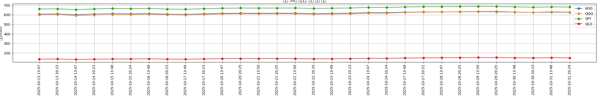
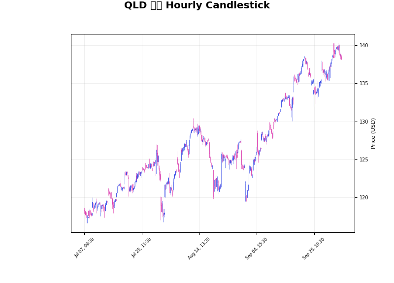

## 미국 ETF 최근 30회 시세

| 시각(UTC) | VOO | QQQ | SPY | QLD |
| --- | --- | --- | --- | --- |
| 2025-08-20 13:47 | 586.12 | 564.76 | 637.63 | 122.06 |
| 2025-08-20 20:24 | 586.63 | 565.89 | 638.12 | 122.60 |
| 2025-08-21 13:47 | 583.38 | 562.54 | 634.60 | 121.06 |
| 2025-08-21 20:23 | 584.28 | 563.28 | 635.54 | 121.44 |
| 2025-08-22 13:45 | 587.93 | 566.32 | 639.61 | 122.62 |
| 2025-08-22 20:23 | 593.21 | 571.99 | 645.30 | 125.14 |
| 2025-08-25 13:47 | 591.76 | 569.67 | 643.72 | 124.04 |
| 2025-08-25 20:23 | 590.66 | 570.35 | 642.49 | 124.39 |
| 2025-08-26 13:48 | 590.31 | 569.52 | 642.16 | 124.00 |
| 2025-08-26 20:23 | 593.04 | 572.61 | 645.09 | 125.39 |
| 2025-08-27 13:45 | 593.30 | 571.16 | 645.38 | 124.70 |
| 2025-09-11 13:41 | 601.16 | 582.09 | 653.97 | 129.12 |
| 2025-09-11 20:19 | 604.58 | 584.09 | 657.61 | 130.03 |
| 2025-09-12 13:42 | 604.48 | 584.45 | 657.49 | 130.12 |
| 2025-09-12 20:21 | 604.39 | 586.66 | 657.40 | 131.15 |
| 2025-09-15 13:42 | 606.78 | 589.53 | 659.97 | 132.41 |
| 2025-09-15 20:22 | 607.59 | 591.68 | 660.91 | 133.38 |
| 2025-09-16 13:45 | 607.30 | 591.77 | 660.59 | 133.36 |
| 2025-09-16 20:23 | 606.79 | 591.18 | 659.94 | 133.08 |
| 2025-09-17 13:43 | 606.71 | 590.13 | 659.90 | 132.61 |
| 2025-09-17 20:22 | 606.15 | 589.94 | 659.18 | 132.54 |
| 2025-09-18 13:43 | 607.98 | 593.98 | 661.08 | 134.35 |
| 2025-09-18 20:22 | 608.94 | 595.37 | 662.29 | 134.96 |
| 2025-09-19 13:43 | 610.00 | 597.01 | 661.62 | 135.65 |
| 2025-09-19 20:22 | 611.78 | 599.35 | 663.62 | 136.72 |
| 2025-09-22 13:45 | 611.07 | 598.64 | 662.77 | 136.67 |
| 2025-09-22 20:23 | 614.76 | 602.22 | 666.78 | 138.29 |
| 2025-09-23 13:45 | 614.79 | 601.10 | 666.80 | 137.77 |
| 2025-09-23 20:23 | 611.51 | 598.20 | 663.28 | 136.44 |
| 2025-09-24 13:45 | 611.77 | 598.29 | 663.55 | 136.42 |
## QLD CANDLESTICK CHART

