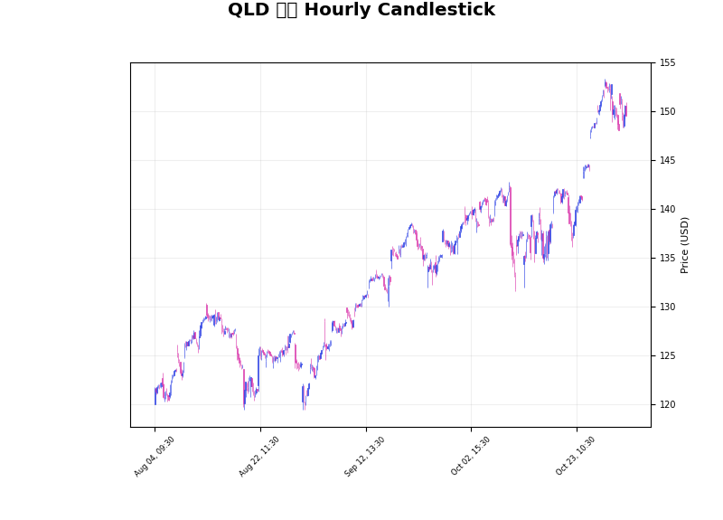

## 미국 ETF 최근 30회 시세

| 시각(UTC) | VOO | QQQ | SPY | QLD |
| --- | --- | --- | --- | --- |
| 2025-08-06 08:15 | 577.35 | 560.27 | 627.97 | 120.51 |
| 2025-08-06 08:19 | 577.35 | 560.27 | 627.97 | 120.51 |
| 2025-08-06 08:21 | 577.35 | 560.27 | 627.97 | 120.51 |
| 2025-08-06 08:25 | 577.35 | 560.27 | 627.97 | 120.51 |
| 2025-08-06 08:46 | 577.35 | 560.27 | 627.97 | 120.51 |
| 2025-08-06 08:50 | 577.35 | 560.27 | 627.97 | 120.51 |
| 2025-08-06 13:58 | 578.64 | 562.55 | 629.48 | 121.45 |
| 2025-08-06 20:26 | 581.59 | 567.32 | 632.69 | 123.53 |
| 2025-08-07 01:10 | 581.64 | 567.32 | 632.78 | 123.54 |
| 2025-08-07 01:34 | 581.64 | 567.32 | 632.78 | 123.54 |
| 2025-08-07 01:41 | 581.64 | 567.32 | 632.78 | 123.54 |
| 2025-08-07 13:57 | 584.98 | 572.93 | 636.35 | 125.99 |
| 2025-08-07 20:27 | 581.18 | 569.24 | 632.25 | 124.37 |
| 2025-08-08 13:56 | 584.51 | 572.87 | 635.84 | 125.89 |
| 2025-08-08 20:25 | 585.72 | 574.55 | 637.13 | 126.62 |
| 2025-08-11 13:56 | 585.87 | 575.01 | 637.32 | 126.81 |
| 2025-08-11 20:23 | 584.52 | 572.76 | 635.83 | 125.84 |
| 2025-08-12 13:51 | 585.76 | 573.75 | 637.23 | 126.28 |
| 2025-08-12 20:26 | 590.75 | 580.05 | 642.65 | 129.00 |
| 2025-08-13 13:53 | 593.90 | 582.97 | 646.05 | 130.27 |
| 2025-08-13 20:25 | 592.83 | 580.33 | 644.87 | 129.10 |
| 2025-08-14 13:53 | 592.22 | 580.73 | 644.20 | 129.26 |
| 2025-08-14 20:25 | 592.77 | 579.86 | 644.93 | 128.84 |
| 2025-08-15 13:47 | 592.51 | 577.29 | 644.53 | 127.67 |
| 2025-08-15 20:24 | 591.57 | 577.34 | 643.45 | 127.65 |
| 2025-08-18 13:54 | 591.19 | 576.29 | 643.08 | 127.20 |
| 2025-08-18 20:23 | 591.36 | 577.11 | 643.28 | 127.57 |
| 2025-08-19 13:47 | 590.65 | 573.90 | 642.47 | 126.06 |
| 2025-08-19 20:24 | 588.15 | 569.28 | 639.77 | 124.08 |
| 2025-08-20 13:47 | 586.12 | 564.76 | 637.63 | 122.06 |
## QLD CANDLESTICK CHART

